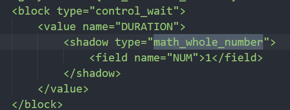

# 修改积木的输入判断
   

block通过XML代码来定义结构 


   

- block标签：积木
  - type：标志符，图示积木中control_wait代表了“等待 %1 秒”
- value标签：指block的一个参数，参数的名字是value标签的name属性，也会和积木定义的参数相对应
- shadow标签：阴影积木  
  - type：引用的已定义的其他block的type,定义了对应的输入规则
- field标签：block的最小组成单元，name属性值需要是已经定义好的Field类型。在XML中field标签可以不写，除非需要修改在积木中显示的默认值

```
//Blockly.Blocks对象包含了所有积木的定义
Blockly.Blocks['math_whole_number'] = {
  //积木初始化时调用的方法
  init: function() {
    //积木的json配置
    this.jsonInit({
        //积木的文案
      "message0": "%1",
        //积木的参数，必须是数组
      "args0": [
        {
            //指明了shadow block的type
          "type": "field_number",
          "name": "NUM",
          "min": 0,
          "precision": 1,
            //validator标志了该部位的数据输入规则
          "validator": text => {
            // 整数
            var regPos = /^\d+$/;
            if (regPos.test(text)) {
              return text
            }
            //如果不符合规则，则置为原来的值
            return null
          }
        }
      ],
      "output": "Number",
      "outputShape": Blockly.OUTPUT_SHAPE_ROUND,
      "colour": Blockly.Colours.textField,
      "colourSecondary": Blockly.Colours.textField,
      "colourTertiary": Blockly.Colours.textField
    });
  }
};

```
积木中args的type属性可以是已经定义的input类型或field类型，input类型的参数是对应了一个shadow block，通常在UI上可以被相同形状的积木覆盖  

常用的fields和inputs  

- Fields  
  - field_dropdown:下拉列表
  - field_checkbox:勾选框
  - field_colour:颜色
  - field_number:数字输入
  - field_angle:角度选择
  - field_variable:变量
  - field_date:日期
  - field_label:标签文本，通常根据message直接生成
  - field_image:图片文本
- Inputs
  - input_value:可被相同形状的积木覆盖的参数，根据“check”:"Boolean","String","Number"的不同，形状不同
  - input_statement:可以连接命令类型积木

  

在相应的field_number.js文件定义了相应类型的规则  

上述中我们传入的**validator**则是对应的**opt_validator**参数，可以根据需要进行修改