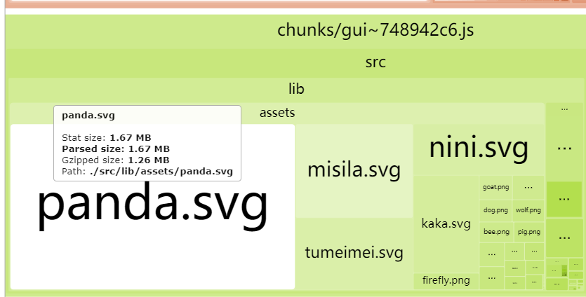

# webpack
## 调试问题
> Use production mode for built-in optimization

目前webpack4中有分development 和 production 模式，很多优化在生产模式下它已经帮我们做了，所以不进行生产模式进行调试无法看出效果，导致做了一些无用功。  

> you get a number of built-in optimizations automatically, such as tree shaking, performance hints, or minification with the TerserWebpackPlugin in production mode.

### Use webpack-bundle-analyzer regularly
没事就用用**webpack-bundle-analyzer**看看目前项目的包体情况，及时做调整。  
这次优化中发现一些资源调度方法已经改变，但是原本与之匹配的静态资源还是保留在项目中，这些慢慢累积起来就很可怕了。  

像下面的这种svg一个就大得一匹，去掉，统统可以去掉

## 代码分割(code splitting)
> Common code splitting aims to combine shared code into separate bundles to achieve smaller bundle sizes and more efficient caching.
 
把多个地方共享的代码打包到一起。  
其中缓存效率的提升是因为浏览器会缓存你的代码，如果你的代码没有分包，一旦有一部分修改了就需要重新去拉取一整个很大的包，分包后就只需要拉取那个修改了的小包，效率就提升起来了。同时前端的路由跳转会申请资源，分包可以避免申请无用的资源。

### webpack中分包的手段
- 入口配置：entry使用多个入口文件
- 使用splitChunks抽取共有代码
- 动态加载(Dynamic imports)

### Add multiple entry points for bundle splitting
设置多入口也是为了分包应对类似于多路由下的资源优化  

- HtmlWebpackPlugin：创建一个html文件把webpack打包后的静态文件自动导入到这个html中

### Separate application code and third-party libs
- SplitChunksPlugin